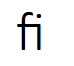
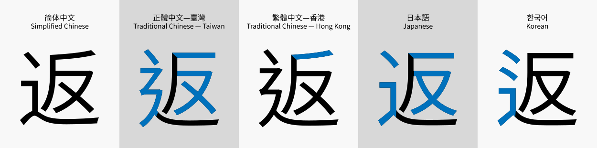

# 文本塑形

本文描述的字符串编码均是 UTF-8，采用 Unicode 码表。

## 问题

1、连写字符塑形

当两个或多个单独的字符组合到一起的时候，可能就变成了另外的字符。这个字符可能并没有对应的 Unicode 码位。例如 "f" 和 "i" 这两个字符组合成 "fi"，在有些语言或艺术字中要写成:



这就是 harfbuzz 的主要作用。

2、国际化

一个字符串并不总是由相同的语言组成。例如，一个字符串可能包含中文、英文、日文、阿拉伯语。每种语言的字符可能需要用不同的字体来渲染。

需要一种检测机制，把字符串拆分成不同的语言，然后选择不同的字体来渲染。

ICU (International Components for Unicode) 是一个开源的库，提供了检测字符串语言的 API。

3、字体回退 (font fallback)

在一个字符串中，如果某个字符没有对应的字体，那么应该选择其他字体来渲染。

在 linux 中，可以使用 fontconfig 来实现字体回退。但是在 windows 中，则需要使用字体回退库。

* https://tex.stackexchange.com/questions/520034/fallback-for-harfbuzz-fonts
* https://stackoverflow.com/questions/29241764/how-do-web-browsers-implement-font-fallback
* https://lists.freedesktop.org/archives/harfbuzz/2012-October/002564.html
* https://zachbayl.in/blog/font-fallback-revery.html
* https://github.com/neovide/neovide/issues/444

4、自动加载系统字体

用户并不需要总是在自己的应用程序中携带字体文件。如果希望直接使用系统字体，则需要使用字体管理器，自动匹配最相似的系统字体。

理想情况下，可以使用字体管理器来加载字体。

```java
BitmapFont font = FontManager.getFont("思源黑体", "Regular", 16);
```

而不是:

```java
BitmapFont font = new FtBitmapFont("fonts/Source_Han_Sans_SC_Regular.otf", 16);
```

5、汉字符统一问题

* [Unicode Han unification](https://en.wikipedia.org/wiki/Han_unification)
* [Source_Han_Sans](https://en.wikipedia.org/wiki/Source_Han_Sans)

一个具有相同Unicode码位(U+8FD4)的个汉字"返" (U+8FD4)，在思源黑体中呈现了不同的形状。



6、空格

很多字体中都不包含空格的图形，所以需要使用一个特殊的图像来渲染空格。需要检测空格的宽度(xadvance)和高度(yadvance)，用一个特殊的图像来渲染空格。

7、断句

当渲染一个字符串的时候，需要检测字符串中的断句符号。例如汉语中“，”和“。”不能写在一行的头部。


## 参考资料

* https://behdad.org/text/